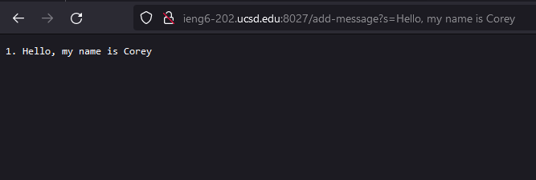
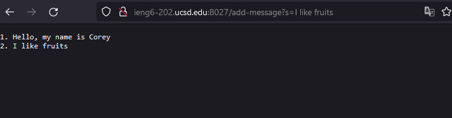
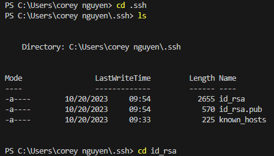
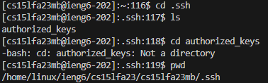
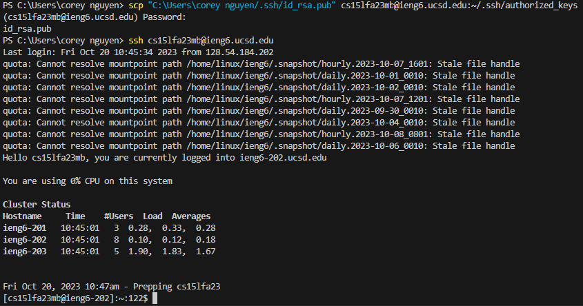

### 📖 StringServer Documentation

---

#### 🚀 Part 1: StringServer Overview

**`StringServer`** is a simple web server written in Java. Its primary purpose is to accept requests of the form `/add-message?s=<string>`. On receiving such a request, it adds the message, prefixed by a line number, to a running string and then returns the updated string as a response.

##### 🔍 Example(s):

1. After visiting the URL path `/add-message?s=Hello`:
    - Response:
    ```
    1. Hello
    ```

2. After visiting the URL path `/add-message?s=How are you`:
    - Response:
    ```
    1. Hello
    2. How are you
    ```
---

#### 📸 Screenshots & Description


(After `/add-message?s=Hello, my name is Corey`):
- **Method Called**: `handleRequest` from the `Handler` class.
- **URI**: Path `/add-message` with query `s=Hello, my name is Corey`.
- **Updates**:
  - String `str` -> `1. Hello, my name is Corey\n`
  - int `num` increases to `1` (before `str` is changed).

 
(After `/add-message?s=I like fruits`):
- **Method Called**: `handleRequest` from the `Handler` class.
- **URI**: Path `/add-message` with query `s=How are you`.
- **Updates**:
  - String `str` -> `1. Hello, my name is Corey\n2. I like fruits\n`
  - int `num` increases to `2` (before `str` is changed).
 
---

### 🛠 Part 2: SSH Key Configuration and Usage Overview

---

#### 🔑 SSH Key Paths 

**1. Path to the Private Key for SSH:**

The path to private key for logging into `ieng6` is:
```bash
$ C:\Users\corey nguyen/.ssh/id_rsa
```
This path is to the private key (`id_rsa`) typically used for SSH access.



---

**2. Path to the Public Key for SSH:**

The path to public key for logging into `ieng6` (within ieng6 account) is:
```bash
$ cs15lfa23mb@ieng6.ucsd.edu:~/.ssh/authorized_keys
```
The path to the public key (`id_rsa.pub`) typically used for SSH access was copied from my computer to this account using `scp`.



---

#### 🌐 Logging into `ieng6` Without Password

To log into `ieng6` without being prompted for a password, we copied the public key (`id_rsa.pub`) to the `~/.ssh/authorized_keys` file on the `ieng6` server. Once done, we simply use:

```bash
$ ssh cs15lfa23__@ieng6.ucsd.edu
```
If set up correctly, we'll be logged into `ieng6` without being prompted for a password.



---

#### 💡 Part 3: Reflection

From this lab, I learned about the potency of straightforward string operations in crafting scalable server applications. By maintaining a running string and adding new messages with incremental line numbers, I can efficiently track and display a sequential list of messages. Beyond this server-side application, I also expanded my knowledge on some fundamental command-line utilities, which are essential tools for any developer or system administrator. Among these were the ssh, scp, and mkdir commands which provided me insight on establishing secure remote servers, on securely transfering files between systems, and create directories, respectively.
